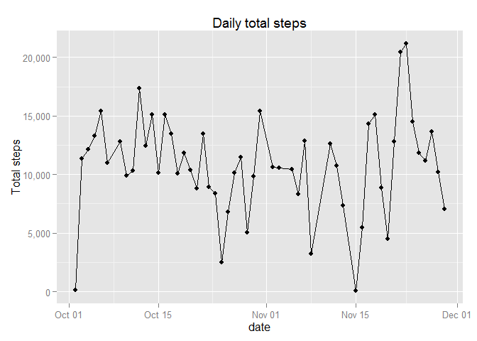
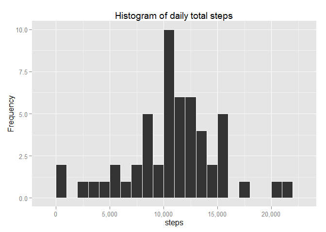
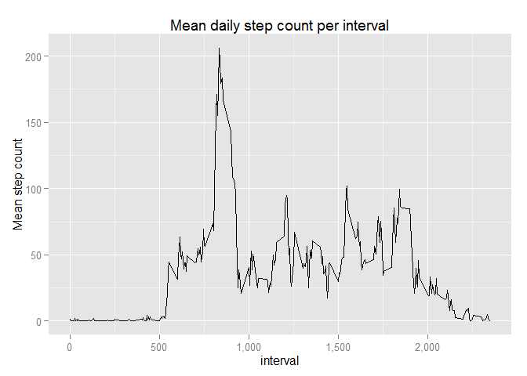
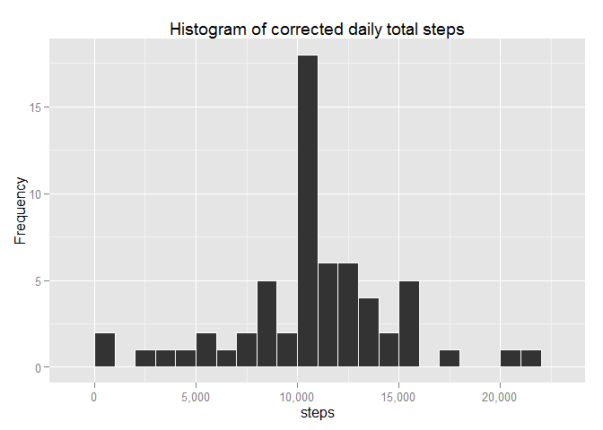
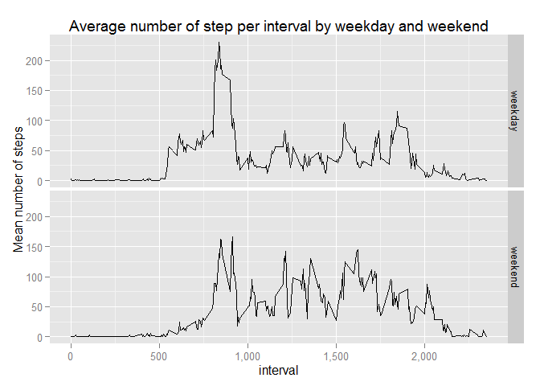

# Reproducible Research: Peer Assessment 1


## Loading and preprocessing the data

```r
        ## load required libraries (these give warning that can be ignored)
        library(ggplot2);library(scales)
        ## Read and process data
        data <- read.csv("../activity.csv")
        activity <- data.frame(steps = data$steps, date = as.Date(data$date))
        activity <- activity[which(!is.na(activity$steps)),]
```
## What is mean total number of steps taken per day?
The total number of steps per day is shown in the figure below.

```r
        dailyTotal <- aggregate(steps ~ date, activity, sum)
                              
        ggplot(dailyTotal, aes(x=date, y=steps)) +
                scale_y_continuous(labels= comma) +
                geom_line() +
                geom_point() +
                labs(title= "Daily total steps") +
                labs(y= "Total steps")
```

 

The distribution of daily total steps taken over the two month period is shown
in the following histogram.

```r
        ggplot(dailyTotal, aes(steps)) + 
                geom_histogram(binwidth=1000, colour="white") +
                scale_x_continuous(labels = comma) +
                labs(title= "Histogram of daily total steps") +
                labs(y= "Frequency")
```

 

```r
        meanSteps <- round(mean(dailyTotal$steps), digits=1)
        medianSteps <- median(dailyTotal$steps)
```
The mean and median steps over the two-month period are 
10766.2 and 10765.0.

## What is the average daily activity pattern?

```r
        dailyActivityPattern <- aggregate(steps ~ interval, data, mean)
        ggplot(dailyActivityPattern, aes(y= steps, x= interval)) +
                geom_line() +
                scale_x_continuous(labels= comma) +
                labs(y= "Mean step count") +
                labs(title= "Mean daily step count per interval")
```

 

```r
        maxActivity <- max(dailyActivityPattern$steps)
        maxTimeInt <- which(dailyActivityPattern$steps == maxActivity)
        maxTimeInt <- dailyActivityPattern$interval[maxTimeInt]
```

The maximum mean interval step count is 206.2 steps and occurs in the 
835th five-minute interval.

## Inputing missing values


```r
        naCount <- sum(is.na(data$steps))
```
There is a total of 2304 missing values. These missing values can be 
replaced by the mean interval step count for that time interval.

```r
        missing <- which(is.na(data$steps))
        corrData <- data
        for (i in missing){
                corrData$steps[i] <- 
                        dailyActivityPattern$steps[dailyActivityPattern$interval 
                                                   == corrData$interval[i]]
        }
## make histogram of new data
        corrDailyTotal <- aggregate(steps ~ date, corrData, sum)
        ggplot(corrDailyTotal, aes(steps)) +
                geom_histogram(binwidth=1000, colour="white") +
                scale_x_continuous(labels = comma) +
                labs(title= "Histogram of corrected daily total steps") +
                labs(y= "Frequency")
```

 

```r
        corrMeanSteps <- mean(corrDailyTotal$steps)
        corrMedianSteps <- median(corrDailyTotal$steps)
        errMeanSteps <- 100*(corrMeanSteps - meanSteps)/meanSteps
        errMedianSteps <- 100*(corrMedianSteps - medianSteps)/medianSteps
```
The corrected mean and median are 
10766.2 and 10766.2.
The corrected mean and median percent difference are
-0.00011 % and 0.01104 %.

## Are there differences in activity patterns between weekdays and weekends?
The following plot shows mean interval number of steps for weekdays and weekend.

```r
        corrData$date <- as.Date(corrData$date)
        corrData$day <- weekdays(corrData$date)
        weekend <- c("Saturday", "Sunday")
        corrData$day <- ifelse(corrData$day %in% weekend, "weekend", "weekday")
        activityPattern <- aggregate(steps ~ interval + day, corrData, mean)        

        ggplot(activityPattern, aes(y= steps, x= interval)) +
                geom_line() +
                facet_grid(day~.) +
                labs(y= "Mean number of steps") +
                labs(title= "Average number of step per interval by weekday and weekend") +
                scale_x_continuous(labels= comma)
```

 
